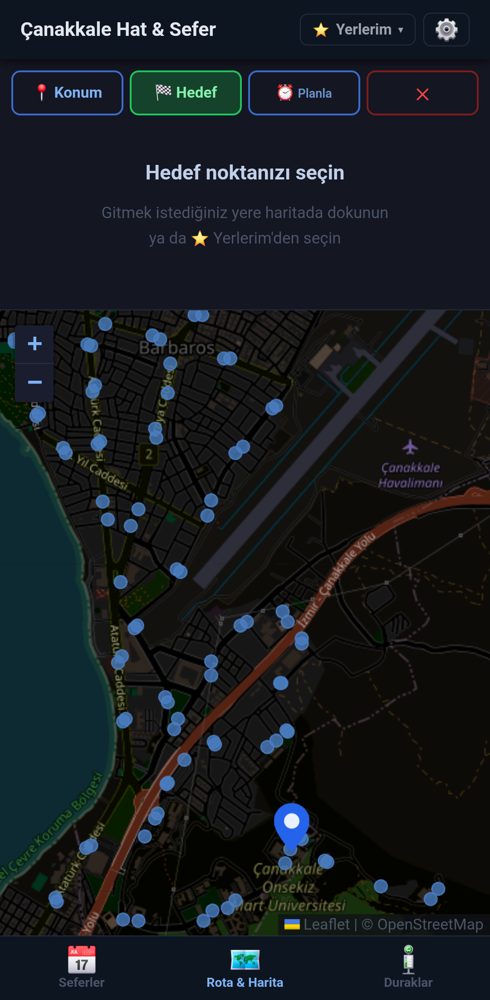
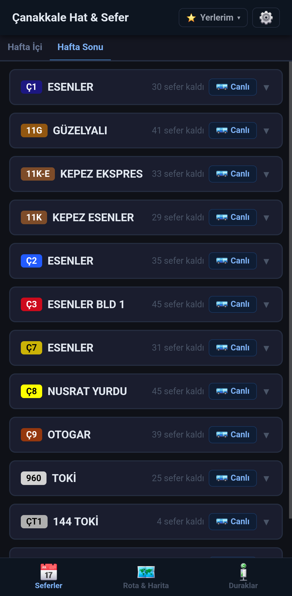
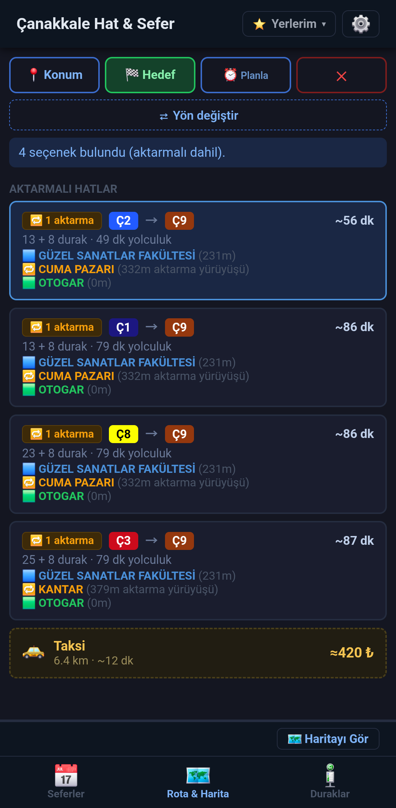
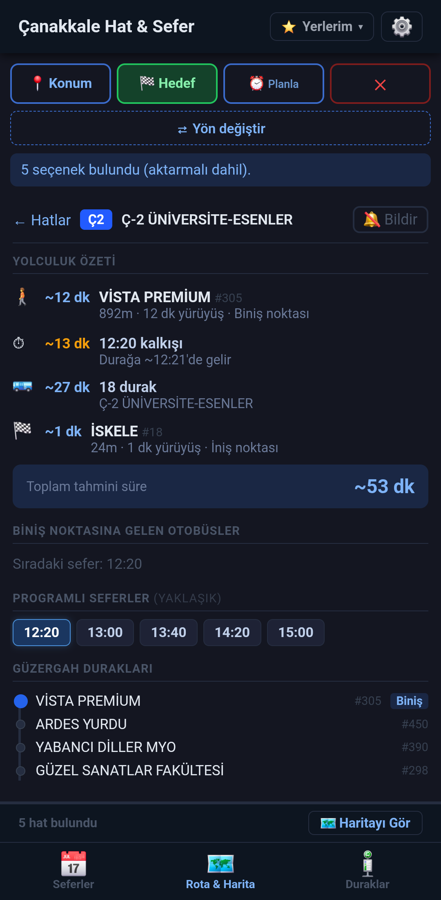
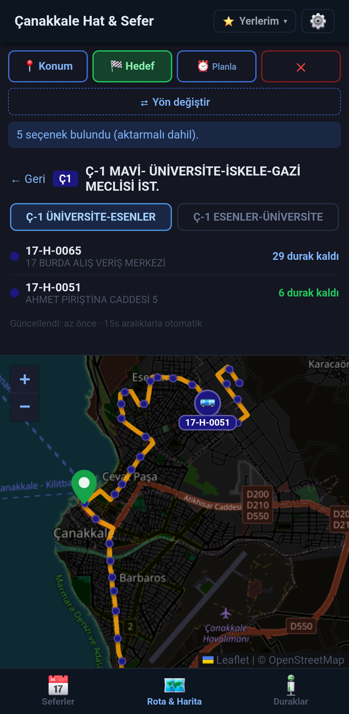

# Çanakkale Hat & Sefer

A mobile-first progressive web app for Çanakkale's public bus network — live tracking, trip planning, schedules, and push notifications, all in a single HTML file with no app store required.



---

## The Problem

Çanakkale's municipal bus system has no official app. Passengers are left with:

- A PDF timetable buried on the municipality website, updated seasonally
- No way to know where a bus actually is right now
- No trip planner — figuring out which bus to take from A to B requires knowing the network by memory
- No alerts when a bus is approaching

This app solves all of that.

---

## Features

### 📅 Seferler — Live Schedule

A dynamic tab row shows every schedule the municipality publishes. Regular weekday and weekend timetables sit alongside any special-day PDFs the city posts — Kurban Bayramı, Arefe, dated one-offs. The tab that matches today's date is preselected.

Each tab lists all routes with departure times split by direction. On today's tab the next upcoming departure is highlighted in blue and past times are greyed out; other tabs show their times plain so they're usable for previewing future or past days.

Each route card has a **🚌 Canlı** button that jumps straight to the live tracker for that line.



---

### 🗺 Rota & Harita — Trip Planner & Live Map

Tap the map (or use GPS) to set your starting point and destination. The planner finds every direct route **and one-transfer trip** that connects them, sorted by **total ETA** — walking time + wait for the next bus + ride time + walking to destination.

- **One-transfer trips** — when no single bus connects A to B, or a transfer gets you there meaningfully faster, the planner builds a two-leg trip with a walking transfer between lines. Both route badges and the transfer stop are shown, and a transfer only outranks a direct bus when it actually saves time
- **Real walking distances** — every walking segment uses Valhalla pedestrian routing, so which stops count as reachable and how long each walk takes reflect actual on-foot distances that cross roads and follow footpaths. The dashed lines on the map carry a duration + distance label, with a straight-line fallback when offline
- **Taxi alternative** — every result list ends with a 🚕 taxi card showing the driving distance, time, and an approximate fare from the Çanakkale tariff. Tap it to draw the cab's route on the map
- **Plan ahead** — use the time offset buttons (+30 dk, +1 sa, +2 sa) to plan for later
- **Live bus data** — shows which buses are approaching your boarding stop right now. Tap a bus to see its current stop and where it's heading next
- **Scheduled fallback** — when no live data is available, the ETA falls back to today's active timetable. On Bayram, Arefe, or any dated special day, the planner automatically consults the matching schedule instead of the regular weekday one
- **Tap a stop to pick it** — while in Konum or Hedef pick mode, tapping any stop circle on the map snaps your pin to that stop exactly
- **Stop browser** — tap any stop on the map to see which routes serve it and when the next bus comes



---

### 🔍 Trip Detail

Tap any route to see a full breakdown:

- Walk to boarding stop
- ⏱ Wait time — live bus position or next scheduled departure with estimated arrival at your stop
- Ride (number of stops)
- For a transfer trip: the transfer stop, the walk between lines, and the wait for the second bus
- Walk to destination
- Total estimated journey time
- Stop timeline with live bus positions marked



---

### 🔴 Live Bus Tracker

Opens from either the Seferler tab (🚌 Canlı button) or the trip planner. Draws the full route on the map and shows all active buses with:

- Route color background with the bus 🚌 emoji
- A heading arrow above the bus pointing toward its next stop (computed from the bus's position and the path geometry — kentkart doesn't broadcast heading)
- The plate number on a colored pill below

Direction buttons let you switch between outbound and inbound. Refreshes every 15 seconds automatically.



---

### 🔔 Push Notifications

Tap **🔕 Bildir** on any trip detail to subscribe to arrival alerts. Notifications fire when your bus is **10, 5, and 2 stops away** — even when your phone screen is off.

Powered by a Cloudflare Worker (free tier) that polls the kentkart API every minute and delivers notifications through Google FCM / Apple APNs — the same always-on channel used by WhatsApp and email.

---

### ⭐ Saved Locations & Quick Re-Pick

Save home, work, or any frequent destination — it appears as a dropdown next to the app title. Tap 📍 or 🏁 to instantly set it as your start or end point without touching the map.

The planner also remembers your **last 5 destinations** as a chip row and offers a **⇄ Yön değiştir** button to swap origin and destination in place when both are set.

---

### 🚏 Duraklar — Stop Hub

A dedicated bottom-tab for finding and managing stops without using the map.

- **Search** by stop name with Turkish-folded matching (`kepez` finds *Kepez*, `iskele` finds *İskele*).
- **Favoriler** — star any stop with ★ to pin it to the top of the list. Persisted across reloads.
- **Son açılanlar** — the last 5 stops you opened.
- **Yakındaki duraklar** — 8 nearest stops by haversine when GPS is granted, with distance shown on every row. Graceful fallback when location is denied.
- **Route chips** — every stop row shows the kentkart route colors that serve it, so you can pick the right stop at a glance.
- **Detail view** — tap a stop to see its routes with live status per direction (*Durağa geldi*, *N durak uzaklıkta*, *Aktif araç yok*, scheduled fallback). Sorted by closest approaching bus first.
- **📍 Haritada göster** — drops a labelled pin for that exact stop on the planner map.
- **🔗 Paylaş** — generates a `?stop=<id>` deep-link via the native share sheet or clipboard so others can open the same stop directly.


---

### 📡 Offline Mode

Once you tap **Settings → "Haritayı offline indir"**, the app works without internet inside the Çanakkale region:

- App shell (HTML, JS, icons, Leaflet) and `schedule.json` / `stops.json` come from the service worker cache
- Every OSM tile inside the Çanakkale bounding box at zoom 13–16 (~5500 tiles, ~65 MB one-time download) is precached, so the map renders fully offline
- Trip planning against the cached schedule, stop browsing, and route exploration all work without network
- Live kentkart bus positions naturally still need network — when offline, a small "Çevrimdışı" badge shows in the header and stale bus markers are cleared rather than left on screen pretending to be live


---

### ⚙️ Settings

A gear icon in the header opens a settings screen with:

- **Theme** — dark / light / follow system
- **Walking radius** — how far you're willing to walk to a stop (300–2000 m)
- **Walking speed** — used for ETA math (50–100 m/min)
- **Offline map download** — described above, with live progress
- **Data management** — clear saved locations, recent destinations, or re-show the onboarding card

---

## Architecture

```
GitHub Actions (hourly cron, fast-skip if unchanged)
────────────────────────────────────────────────────
fetch-schedule.mjs              fetch-stops.mjs
  ↓ download PDFs                 ↓ kentkart bulk fetch
  ↓ parse with pdf.js             ↓ strip live bus data
  ↓                               ↓
data/schedule.json          data/stops.json
        │                         │
        └──────────┬──────────────┘
                   ↓
             GitHub Pages
             index.html + sw.js + manifest
                   │
        ┌──────────┴───────────────────┐
        ↓                              ↓
  Service Worker                   Kentkart API
  ────────────────                 (live bus positions,
  • Precache app shell             fetched on demand
  • Stale-while-revalidate JSON     — no caching)
  • Cache-first OSM tiles
  • Network-first HTML w/ fallback
        │
        ↓
  POST /subscribe
        │
  Cloudflare Worker (KV storage)
        │
  cron: every 1 min → GET /pathInfo → Web Push
                                           │
                                      Google FCM / APNs
                                           │
                                      Your phone 🔔
```

Everything except the notification worker runs entirely in the browser. No backend, no database, no user accounts. Cached static data is regenerated by the hourly Actions cron, which fast-skips when nothing on the source side has changed.

---

## Tech

- **Schedule data** — GitHub Actions parses the municipality's PDF timetables hourly using [pdf.js](https://mozilla.github.io/pdf.js/) (Node.js, server-side) and commits pre-built JSON to the repo. The parser knows how to skip footnote/annotation lines that would otherwise corrupt neighbouring routes
- **Stop & route data** — GitHub Actions fetches all kentkart route/stop/path data hourly and commits it as static JSON. Fast-skips when nothing has changed
- **Maps** — [Leaflet](https://leafletjs.com/) with OpenStreetMap tiles, all vector layers sharing one explicit `L.canvas` renderer (avoids the multi-canvas event-stacking pitfall that breaks hit-testing)
- **Offline** — Service worker precaches the app shell + Leaflet CDN, stale-while-revalidates the JSON data, and cache-firsts OSM tiles with a FIFO cap. An on-demand tile downloader fetches every tile in the Çanakkale bbox at the allowed zoom range so the map works fully offline once primed
- **Live data** — [Kentkart](https://kentkart.com) public API fetched directly by the browser (same data used by physical stop displays). A 15s connectivity probe drives the offline indicator
- **Walking & driving directions** — [Valhalla](https://valhalla.openstreetmap.org/) pedestrian routing decides which stops are reachable and how long each walk takes, batched through its distance-matrix API so the whole plan needs only a few requests. The taxi estimate uses Valhalla's shortest-path car route, since a meter bills distance driven. Straight-line + walk-speed fallback when the service is unreachable. The public OSRM demo is deliberately avoided — its `/foot/` endpoint actually returns car routing, which inflated short pedestrian moves and hid reachable stops
- **Push** — Web Push (RFC 8030/8291/8292) via Cloudflare Workers + KV
- **Zero runtime dependencies** — no frameworks, no build step
